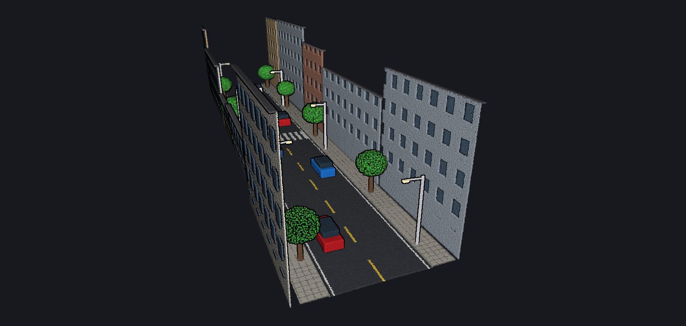
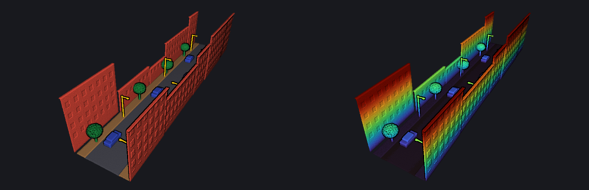
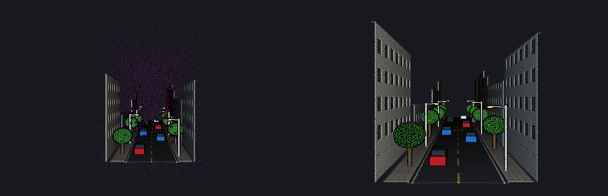

# PointCloudViz

[](https://github.com/SuLiverse/PointCloudViz_Final/actions/workflows/ci.yml)


基于 C# / WPF / .NET 10 的三维点云可视化与量测工具：读取 LAS / PLY / XYZ，按真彩色、高程、强度或分类着色，
做体素下采样与离群点剔除，并在点云上量测坐标、距离、折线与面积。核心算法是一个与界面无关、带单元测试的类库，
同时提供可在 Linux / macOS 上运行的命令行工具 `pcv`。



> 上图及下方所有图片均由本项目的命令行工具 `pcv render` 离屏渲染生成，数据由 `pcv generate` 合成。

项目起源于面向对象程序设计课程期末作品（v1.0），2.0 版本对架构、正确性和功能做了全面升级，详见 [更新日志](CHANGELOG.md)。

## 功能

**数据读写**
- LAS 1.0 – 1.4，点数据格式 0 – 10（含 1.4 扩展点数）；写出 LAS 1.2 / 1.4（分类码 > 31 时自动升级到 1.4）
- PLY：ASCII、二进制小端 / 大端，读写都支持；XYZ / TXT / CSV：自动识别列布局与分隔符
- 测绘大坐标（UTM、高斯-克吕格）全程以“双精度原点 + 单精度局部坐标”存储，读写与量测保持毫米级精度
- 超大文件可设置读取上限；显示点数上限独立于数据本身（随机抽稀，不产生条纹）

**可视化**
- DirectX 11 渲染（HelixToolkit），Z 轴朝上的转台式相机：左键旋转、右键平移、朝光标缩放、双击设旋转中心
- 着色：真彩色 / 高程 / 强度 / ASPRS 分类 / 单色；Viridis、Turbo、地形等色带，自动 2%–98% 分位范围，带图例
- 分类面板：按类勾选显示/隐藏，显示各类点数与占比；高程直方图
- 俯视、前视、侧视、轴测等预设视角（带平滑过渡），截图导出 PNG

**处理**（全部可撤销 / 重做，耗时操作带进度条并可取消）
- 高程过滤、分类筛选、随机抽稀
- 体素下采样（无哈希碰撞的体素编码）
- 统计离群点剔除 SOR、半径离群点剔除 ROR（基于 KD 树并行计算）

**量测**
- 坐标拾取；距离（斜距、平距、高差、坡度）；折线长度；多边形面积（空间面积与水平投影面积）
- 量测结果以标注形式绘制在点云上方，列表管理，可导出 CSV，保存在项目文件中

**其它**
- 项目文件（`.pcvproj`）保存数据路径（相对路径）、显示设置、相机与量测，兼容旧版 JSON 项目
- 拖放打开、最近文件、命令行参数打开、Windows 11 Fluent 主题（跟随系统深浅色）
- 合成街景生成器：道路、标线、人行道、建筑立面、行道树、车辆、路灯与噪声点，带分类

| 分类着色 / 高程着色（Turbo） |
| --- |
|  |

| 统计离群点剔除：处理前（品红色为噪声点） / 处理后 |
| --- |
|  |

## 快速开始

### 运行桌面程序

环境：Windows 10 / 11，支持 DirectX 11 的显卡（集成显卡即可）。

- **下载**：在 [Releases](https://github.com/SuLiverse/PointCloudViz_Final/releases) 下载 `PointCloudViz-win-x64.zip`（自包含，无需安装 .NET），解压后运行 `PointCloudViz.exe`。
- **从源码运行**：安装 [.NET 10 SDK](https://dotnet.microsoft.com/download)，然后

  ```powershell
  git clone https://github.com/SuLiverse/PointCloudViz_Final.git
  cd PointCloudViz_Final
  dotnet run --project src/PointCloudViz.App
  ```

  也可以用 Visual Studio 2026 打开 `PointCloudViz.sln`，将 `PointCloudViz.App` 设为启动项目。

启动后点击“打开示例数据”即可看到上图的街景；也可以把 `.las` / `.ply` / `.xyz` 文件直接拖进窗口。按 **F1** 查看全部快捷键。

### 常用操作

| 操作 | 方式 |
| --- | --- |
| 旋转 / 平移 / 缩放 | 左键拖动 / 右键（或中键）拖动 / 滚轮（朝光标缩放） |
| 设置旋转中心 | 双击点云 |
| 漫游 | 单击视口后 `W` `A` `S` `D` 水平移动，`Q` `E` 升降，按住 `Shift` 加速 |
| 视角 | `R` 适应窗口，`1` 俯视、`2` 前视、`3` 左视、`0` 轴测 |
| 量测 | 工具栏选择“坐标 / 距离 / 折线 / 面积”后单击点云；折线与面积用双击、右键或 `Enter` 结束，`Backspace` 撤回顶点 |
| 撤销 / 重做 | `Ctrl+Z` / `Ctrl+Y`（滤波与量测都可撤销） |
| 截图 | `F12` |

### 命令行工具 pcv

`pcv` 只依赖核心库，可在任何平台运行，适合批处理：

```bash
# 查看信息（LAS 头、范围、密度、分类统计）
dotnet run --project src/PointCloudViz.Cli -- info samples/street_scene.las

# 格式转换并串联滤波：统计离群点剔除 → 0.1 m 体素下采样
dotnet run --project src/PointCloudViz.Cli -- convert input.las output.ply --sor 16 --voxel 0.1

# 离屏渲染预览图（无需显卡）
dotnet run --project src/PointCloudViz.Cli -- render input.las -o preview.png --color Classification --view Top

# 生成合成街景
dotnet run --project src/PointCloudViz.Cli -- generate street.las --spacing 0.08
```

## 项目结构

```text
PointCloudViz.sln
├── src/
│   ├── PointCloudViz.Core/       # 跨平台核心库（net10.0，无 UI 依赖）
│   │   ├── Data/                 #   PointCloud（双精度原点 + 局部坐标）、包围盒、颜色
│   │   ├── IO/                   #   LAS / PLY / XYZ 读写与格式注册表
│   │   ├── Spatial/              #   KD 树
│   │   ├── Processing/           #   滤波器（体素、SOR、ROR、高程、分类、抽稀）
│   │   ├── Analysis/             #   统计、直方图、PCA 平面拟合
│   │   ├── Coloring/             #   色带、分类配色、着色器
│   │   ├── Measurements/         #   量测几何与 CSV 导出
│   │   ├── Picking/ Viewing/     #   点拾取、Z 轴朝上的轨道相机
│   │   ├── Rendering/            #   软件渲染器（EDL）与 PNG 编码
│   │   ├── History/ Project/     #   撤销/重做、项目文件
│   │   └── Synthetic/            #   合成街景生成
│   ├── PointCloudViz.App/        # WPF 桌面程序（MVVM）
│   └── PointCloudViz.Cli/        # 命令行工具 pcv
├── tests/PointCloudViz.Core.Tests/   # xUnit 单元测试
├── samples/                      # 示例数据
└── docs/                         # 架构说明、图片、开发日志
```

架构与关键设计决策见 [docs/architecture.md](docs/architecture.md)。

## 开发

```bash
dotnet build PointCloudViz.sln            # Windows 上构建全部项目
dotnet test tests/PointCloudViz.Core.Tests # 任意平台运行单元测试
```

- 在 Linux / macOS 上也能编译 WPF 项目（`EnableWindowsTargeting` 已开启），但只能在 Windows 上运行。
- 全部项目开启可空引用与“警告视为错误”，依赖版本集中在 `Directory.Packages.props`。
- GitHub Actions：Linux 上运行单元测试与 CLI 端到端流程；Windows 上构建、发布，并以 `--smoke-test` 模式实际启动程序加载示例数据、渲染并检查截图；推送 `v*` 标签自动打包发布。

## 已知限制

- 暂不支持 LAZ 压缩格式（会给出提示），可先用 LAStools / PDAL 解压。
- 所有点一次性载入内存（每点 20 字节，1000 万点约 200 MB），尚未实现 Potree 式的分层流式加载。
- 桌面端依赖 HelixToolkit.Wpf.SharpDX 2.x（以 .NET Framework 兼容方式运行）；迁移到 HelixToolkit 3.x 留作后续工作。

## 后续计划

- 八叉树分层 LOD 与按需加载，支持亿级点云
- LAZ 读取、E57 支持
- 剖面（截面）工具、地面滤波（CSF）与 DEM 生成
- 多点云叠加与配准（ICP）

## 项目背景

这是面向对象程序设计课程的期末项目（测绘工程专业）。v1.0 从简单的点云显示开始，逐步加入了格式读取、相机控制、
过滤、测量和 UI 反馈，开发过程记录在 [docs/dev-log](docs/dev-log/)。2.0 版本在保留原有功能与面向对象设计思路的基础上，
重构为“核心库 + 桌面程序 + 命令行”的分层结构，修复了大坐标精度、相机、量测等方面的问题，并补充了自动化测试与持续集成。

## License

当前仓库暂未声明开源许可证。如需复用代码，请先联系作者。
