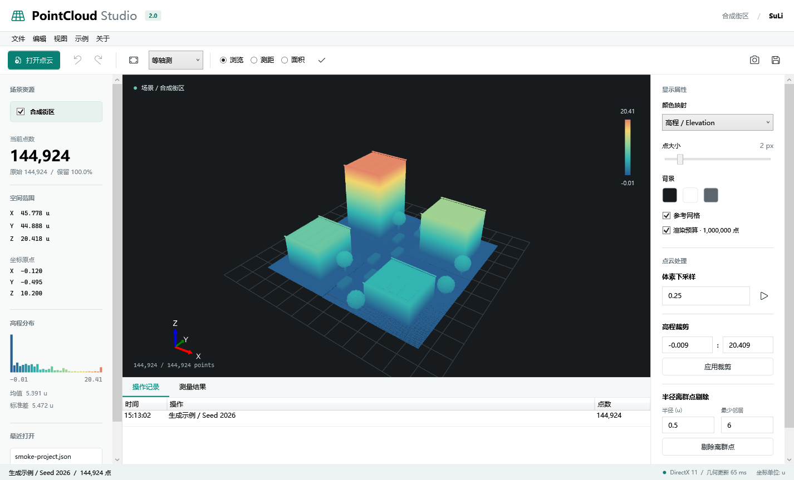
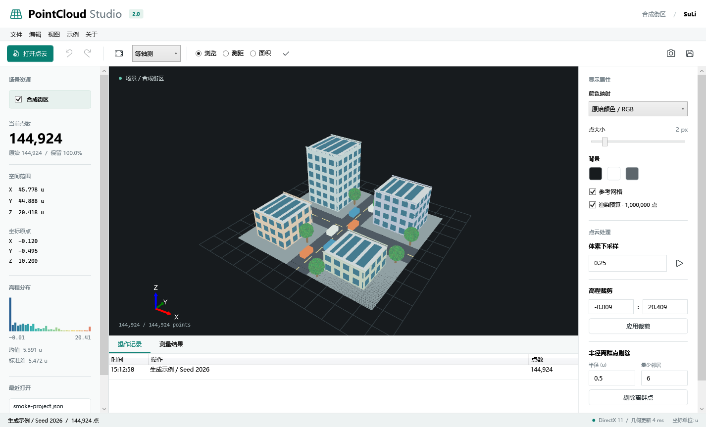

# PointCloud Studio

基于 C# / WPF / .NET 8 的原生三维点云工作台，维护者 **SuLi**。由面向对象程序设计结课作品 **PointCloudViz_Final** 演进而来，保留原始项目名称、课程样例和开发记录。

2.0 将原先的菜单式演示升级为可操作的桌面工作台，同时补上数据完整性、可撤销处理、项目快照和自动化验证。



## 主要能力

- **直接进入三维场景**：内置确定性合成街区，包含建筑立面、屋顶、道路、车辆和树木，144,924 个真实点，无网络资源依赖。
- **完整工作台**：场景资源、坐标范围、高程直方图、实时统计、显示属性、处理面板、操作记录和测量列表。
- **三种着色**：高程、原始 RGB、强度；可调点大小、背景、参考网格和点云显隐。
- **三维交互**：Z 轴向上，旋转、平移、缩放、等轴测/俯视/正视和适应窗口。
- **可取消任务**：导入、过滤、点云导出和项目保存。取消或读取失败不替换正在查看的数据。
- **无静默丢点**：模型不再自动删减点数；100 万点渲染预算只影响显示，不影响统计、过滤和导出。
- **统一撤销重做**：高程裁剪、体素下采样、半径离群点剔除及恢复原始数据均可撤销。
- **真实点拾取**：使用渲染器的实际相机矩阵、屏幕半径和前向裁剪；支持两点距离、共面简单多边形面积。
- **可移植项目快照**：保存当前处理后的点云、RGB/强度、相机、显示参数和测量结果，校验数据文件的 SHA-256。
- **导出**：XYZ、二进制 PLY、视口 PNG、含各顶点坐标的测量 CSV。
- **桌面工作流**：拖入单个数据/项目文件、最近打开列表、快捷键、未保存更改确认。



## 格式支持

| 格式 | 读取 | 写出 | 约束 |
| --- | --- | --- | --- |
| XYZ / TXT | 是 | XYZ | 支持 XYZ、XYZI、XYZRGB、XYZIRGB；RGB 为 0-255 整数 |
| PLY ASCII | 是 | 否 | 属性按名称读取，顶点与其他元素分别解析 |
| PLY binary little-endian | 是 | 是 | 保留坐标、RGB、强度 |
| PLY binary big-endian | 是 | 否 | 支持常见标量类型 |
| LAS 1.0-1.4 | 是 | 否 | 点格式 0、1、2、3、6、7、8；保留噪声分类点，不擅自过滤 |
| LAZ | 否 | 否 | 需先使用 PDAL / CloudCompare 解压或转换 |

XYZ 中六列明确解释为 XYZRGB，而不是把 R 误当强度。格式错误、非有限坐标、截断 PLY/LAS 和不支持的记录类型会报错，不再悄悄跳过坏行。

## 运行

需要 Windows 10/11、.NET 8 SDK 和支持 DirectX 11 的图形环境。使用发布目录运行时只需要 **.NET 8 Desktop Runtime x64**，而不是 SDK。

```powershell
git clone https://github.com/SuLiverse/PointCloudViz_Final.git
cd PointCloudViz_Final
dotnet restore PointCloudViz_Final.sln --locked-mode
dotnet run --project PointCloudViz_Final -c Release
```

本仓库也提供启动脚本，优先使用工作区 `.tools/dotnet` 中的 SDK（若存在），否则使用 PATH 中的 `dotnet`：

```powershell
.\scripts\run.ps1
.\scripts\run.ps1 -File C:\data\scan.ply
```

首次启动显示内置街区。课程原始 `sample_final.xyz` 可通过“示例”菜单打开。原始 `sample_final.ply` 仍保留在仓库根目录。

## 操作

| 操作 | 输入 |
| --- | --- |
| 旋转 / 平移 / 缩放 | 左键拖动 / 右键或中键拖动 / 滚轮 |
| 适应窗口 | F |
| 平面移动 / 上下移动 | 视口聚焦时 WASD / QE |
| 打开 / 保存快照 | Ctrl+O / Ctrl+S |
| 撤销 / 重做 | Ctrl+Z / Ctrl+Y |
| 测量选点 | 切换测距或面积模式后点击实际点 |
| 测量时临时旋转 | Alt+左键拖动 |
| 结束一组面积选点 | Enter 或工具栏勾号 |
| 退出测量 / 取消任务 | Esc |

面积按点击顺序计算，保留凹多边形边界；拒绝非共面、共线或自交的边界。距离标注为 **u**，面积为 **u²**，不会在不知道数据坐标单位时伪装成米。

## 项目文件

“保存项目快照”产生两个文件，移动时请一起携带：

```text
scene.json
scene.<唯一标识>.xyz
```

- JSON 使用相对路径，记录版本、SHA-256、相机、着色、点大小、渲染预算和测量。
- XYZ 是**当前处理结果**的完整快照，不依赖原始导入文件仍然存在。
- 写入先完成新的数据文件，再原子替换 JSON。失败不会覆盖旧项目。
- 再次保存使用新的数据文件；旧伴随文件不自动删除，避免损坏其他项目引用。确认不再被任何项目引用后可手动清理。
- 重新打开时，快照成为该会话的原始基线；撤销历史不跨会话保存。
- 兼容旧版路径型项目；旧项目没有有效相机状态时自动适应窗口。
- 点云显隐和参考网格属于当前会话设置，不写入快照。

最近文件与滚动日志位于 `%LOCALAPPDATA%/PointCloudStudio`。可通过 `POINTCLOUD_STUDIO_HOME` 指定其他状态目录。数据本身不上传到任何服务。

## 构建与验证

```powershell
.\scripts\verify.ps1
.\scripts\verify.ps1 -Smoke
```

- **回归测试**：读取器、二进制字节序、坏文件/取消、原子写入、模型不丢点、过滤、撤销顺序/内存预算、测量几何、项目校验和格式往返。
- **原生 GPU 冒烟**：启动真实 WPF 窗口，检查 GPU 像素、着色和相机变化、拾取、过滤/撤销、失败导入、取消和快照恢复；输出两种窗口尺寸的截图。
- 冒烟需要可交互的 Windows 桌面与 DirectX 11；不把无图形环境的 CI 构建冒充 UI 验证。
- GitHub Actions 在 Windows 上执行锁定依赖还原、零告警构建、回归测试和 win-x64 发布，并上传可运行目录与 TRX。

验证记录见 [docs/VERIFICATION.md](docs/VERIFICATION.md)。截图由原生冒烟程序生成，不是设计稿。

发布到本地目录：

```powershell
dotnet publish PointCloudViz_Final -c Release -r win-x64 --self-contained false -o artifacts/publish
```

## 工程结构

```text
PointCloudViz_Final/
  MainWindow.xaml                 工作台布局
  MainWindow.xaml.cs              任务、文档、快照、撤销与文件工作流
  MainWindow.Rendering.cs         GPU 几何、相机、显示与交互拾取
  IO/                             校验读取器、原子写入、XYZ / PLY 导出
  Models/                         点记录、点云与包围盒
  Filters/                        可取消的过滤算法
  Patterns/                       命令历史与点云变更命令
  Services/                       快照、统计、确定性合成场景
  Tools/                          测量几何与 CSV 导出
PointCloudViz_Final.Tests/         自动化回归
PointCloudViz_Final.Smoke/         原生图形与工作流验证
scripts/                          启动与验证入口
log/                              保留的课程开发记录
```

采用兼容现代 .NET 的 `HelixToolkit.SharpDX.Core.Wpf 2.27.3`，移除没有被使用的 LasSharp 依赖。历史软件渲染器保留作课程参考；主工作台使用 Helix/DirectX 11，**并不声称提供无 GPU 的透明回退**。

## 明确边界

- 这是内存型单点云工作台，不是无限规模的分块磁盘数据库。LAS 默认完整读取，超过 1,000 万点明确拒绝；其他格式也需要足够内存。
- 历史最多 50 步，并按约 256 MiB 的快照估算预算淘汰最旧记录。最新一步始终保留，因此单步超大数据仍可能超过预算。
- 坐标仍为 `float32`；渲染去中心化能改善显示稳定性，但不能恢复输入时已损失的大地坐标精度。不用于宣称测绘级绝对精度。
- 支持的是平面简单多边形面积，不是曲面面积、带洞多边形或自动拓扑重建。
- 不支持 PLY 顶点上的 list 属性、LAS waveform 点格式 4/5/9/10、LAZ 和未声明的自定义字段。
- Windows .NET 8 和 SharpDX 技术路线保留兼容性；跨平台、配准、分割和更高精度坐标是后续独立演进项。

## 项目背景与许可

本项目从面向对象程序设计结课作业开始，也是原仓库作者的第一个 GitHub 项目。原始课程记录与样例保留，2.0 的目标是让作品在可演示性之外具备可以重复验证的工程质量。

仓库仍未声明开源许可证；本次升级不替作者擅自授予新的代码许可。依赖组件遵循各自许可证。
