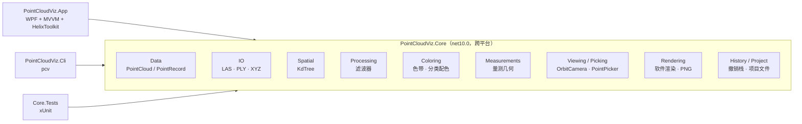

# 架构说明

## 分层



v1.0 的全部逻辑都在一个 WPF 项目里，`MainWindow.xaml.cs` 约 1400 行，点结构直接使用 `System.Windows.Media.Color`，
因此任何算法都无法脱离界面测试。2.0 把与界面无关的部分抽成 `PointCloudViz.Core`：

- **Core 不引用 WPF**：颜色用自定义的 `Rgb24`，向量用 `System.Numerics`。因此可以在 Linux CI 中测试，也能被命令行工具复用。
- **App 只负责交互和显示**：`MainViewModel` 通过 `ISceneView` 接口操作三维场景，`PointCloudViewport` 是唯一接触 Helix 的类。
- **Cli** 证明了核心库的独立性，同时为 README 生成预览图。

## 关键设计

### 1. 双精度原点 + 单精度局部坐标

测绘坐标通常是百万量级（如 UTM 北坐标 4,860,000 m）。`float` 只有 24 位有效位，在这个量级上的分辨率约 0.5 m，
旧版直接把世界坐标存为 `float`，读入时就已丢失精度，渲染前再减偏移已无法挽回。

新版 `PointCloud` 保存一个 `double` 原点，点坐标为相对原点的 `float`：

```
世界坐标 = Origin（double） + Position（float，数值小）
```

读取器在解析时就以 double 计算差值（`PointCloudBuilder`），加载后原点移到包围盒中心。GPU 直接渲染局部坐标；
量测、导出、状态栏显示时再加回原点。测试 `Builder_PreservesMillimetrePrecisionForUtmCoordinates` 验证了毫米级往返精度。

### 2. 不可变点云 + 命令模式

所有滤波器实现 `IPointFilter.Apply(PointCloud) → PointCloud`，不修改输入。撤销/重做只需在两个引用之间切换，
命令对象由 `DelegateCommand(description, execute, undo)` 表示，量测的添加、删除、清空也走同一个 `UndoRedoStack`。
栈容量有限，超出时 O(1) 丢弃最早的记录。

带掩码的滤波器（高程、分类、ROR、SOR、抽稀）继承 `MaskFilter`（模板方法），只需实现“每个点是否保留”。

### 3. KD 树

`KdTree` 是隐式平衡树：只有一个排列后的索引数组和每个节点的划分轴，没有节点对象。构建使用 Hoare 划分的快速选择，
大量重复坐标（规则网格）时仍保持平衡；大子树并行构建。提供半径搜索、可提前终止的半径计数（ROR 只需判断“够不够数”）
和基于固定容量最大堆的 k 近邻。测试将三种查询与暴力搜索逐一比对。

### 4. 单一数据源的相机

旧版同时存在“自己的相机变量”和 Helix 内置相机，Helix 的手势会修改相机，程序再每帧同步回来、
在鼠标事件里保存/恢复状态，导致“缩放后视角被重置”等问题。

新版关闭了 Helix 的全部内置手势，相机状态只存在于 `OrbitCamera`（Core 中的纯数学类，Z 轴朝上、俯仰角限制在 ±89.5°），
每次变化后单向写入 Helix。投影、拾取射线、适应窗口、朝光标缩放都在 Core 中实现并有单元测试。
`Fit` 会迭代地把包围盒投影中心移到屏幕中心，狭长场景也能充满画面。

### 5. 拾取

旧版把所有点投影到屏幕再用 LINQ 排序（每次点击 O(n log n) 并大量分配）。`PointPicker` 并行单遍扫描，
在以射线为轴的圆锥（半顶角 = 像素容差 × 每像素视角）内选择离相机最近的点，因此不会“穿透”选中后面的点。
射线优先使用 Helix 的反投影，保证与实际渲染完全一致。

### 6. 量测

- 顶点按点击顺序连接（旧版按极角重排，凹多边形会算错）。
- 空间面积使用 Newell 向量面积，对略微不共面的点给出最佳投影平面上的面积（旧版会以“选点不共面”拒绝计算，
  而真实点云上的选点几乎总有几厘米起伏）；另给出测绘常用的水平投影面积。
- 距离同时给出斜距、平距、高差、坡度。

### 7. 着色

着色模式由点云属性决定是否可用；高程/强度的自动范围取 2%–98% 分位（直方图近似），避免少数离群点把颜色“压扁”。
自动范围在完整点云上计算，而不是显示子集，所以调整显示上限不会改变配色。

### 8. 显示与数据分离

“显示上限”通过可复现的随机抽样（部分 Fisher–Yates）生成显示子集，隐藏的分类在此阶段剔除；数据本身不受影响。
随机抽样避免了按固定步长抽稀在扫描线数据上产生的条纹。

## 测试与持续集成

- `tests/PointCloudViz.Core.Tests`：读写往返（含 UTM 坐标精度、PLY 大端、LAS 8/16 位颜色、LAZ 拒绝）、KD 树与暴力比对、
  各滤波器、量测几何、相机数学、拾取、渲染与 PNG 编码、撤销栈、项目文件迁移、合成数据确定性。
- CI（`.github/workflows/ci.yml`）：
  - Linux：单元测试 + 覆盖率、CLI 端到端（生成 → 统计 → 滤波转换 → 渲染）。
  - Windows：构建整个解决方案、发布，并以 `--smoke-test` 启动真实的桌面程序：加载示例数据、渲染、截图，
    并检查截图中被点云覆盖的像素比例，确保不是“黑屏”。
- Release（`.github/workflows/release.yml`）：推送 `v*` 标签时生成自包含单文件的桌面程序和三个平台的 `pcv`。
